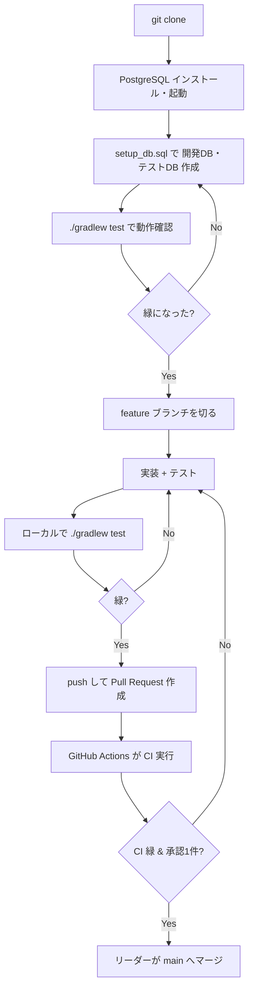

# protospace-d

プロトタイプ共有Webアプリケーション。
Spring Boot (Java 21) + Thymeleaf + MyBatis + Flyway + PostgreSQL で構築。

---

## 技術スタック

| 分類 | 技術 |
|------|------|
| 言語 | Java 21 |
| フレームワーク | Spring Boot 3.5.x |
| ビルドツール | Gradle (wrapper同梱) |
| テンプレート | Thymeleaf |
| DBアクセス | MyBatis |
| マイグレーション | Flyway |
| DB | PostgreSQL |
| CI | GitHub Actions |

---

## DB構成

このプロジェクトはローカルに2つのDBを使う。

| DB | 用途 |
|------|------|
| `protospace_development` | 開発用。普段の動作確認に使う |
| `protospace_test` | テスト用。`./gradlew test` が使う。**開発DBを汚さない** |

テストは `protospace_test` を見るので、テストデータが開発DBに残ることはない。
それぞれの接続設定は以下に記載：

- 開発用: `src/main/resources/application.properties`
- テスト用: `src/test/resources/application.properties`

> ⚠ DB名・ユーザー・パスワードは設定ファイルと完全に一致させること。
> ズレると `DataSourceBeanCreationException` で起動に失敗する。

---

## 環境構築（メンバー全員が各自実施）

### 前提
- WSL (Ubuntu) 環境
- Java 21（無くても gradlew が面倒を見る）

### 1. リポジトリを取得

```bash
git clone https://github.com/mfukui-smartscape/protospace-d.git
cd protospace-d
```

### 2. PostgreSQL をインストール＆起動

```bash
sudo apt update
sudo apt install -y postgresql postgresql-contrib
sudo service postgresql start
```

起動確認（`online` と表示されればOK）:

```bash
sudo service postgresql status
```

### 3. データベース・ユーザーを作成

```bash
sudo -u postgres psql -f setup_db.sql
```

`setup_db.sql` が **開発用・テスト用の両方のDB**、ユーザー、権限をまとめて作成する。

### 4. 動作確認

```bash
./gradlew test
```

`BUILD SUCCESSFUL` が出れば環境構築完了。
（Flyway が起動時にテーブルを自動作成する）

---

## DBセットアップSQL（参考: setup_db.sql の中身）

```sql
-- 開発用DB
CREATE DATABASE protospace_development;
-- テスト用DB
CREATE DATABASE protospace_test;

-- ユーザー作成
CREATE USER protospace WITH PASSWORD 'password';

-- 権限付与
GRANT ALL PRIVILEGES ON DATABASE protospace_development TO protospace;
GRANT ALL PRIVILEGES ON DATABASE protospace_test TO protospace;

-- PostgreSQL 15+ で必要（publicスキーマへの権限）
\c protospace_development
GRANT ALL ON SCHEMA public TO protospace;

\c protospace_test
GRANT ALL ON SCHEMA public TO protospace;
```

---

## チーム開発ルール

### ブランチ運用
- `main` への直接 push は禁止。**必ず Pull Request 経由**で変更を取り込む。
- 作業は機能ごとに feature ブランチを切る（例: `feature/user-signup`）。

### Pull Request / マージ
- PR には **承認（approve）1件以上が必須**。お互いにレビューし合うこと。
- **`main` へのマージはリーダーが行う**（最終的なマージ操作の集約）。
- マージ前に **CI（テスト）が緑であること**が必須。赤い PR はマージ不可。

### CI / テスト
- PR を出すと GitHub Actions が自動でテストを実行する。
- まだ実装していない機能のテストは `@Disabled`（skip）にしておき、CIを緑に保つ。
  実装が済んだら skip を外す → これが Red→Green のサイクルになる。
- 作業途中で共有・相談したい PR は **Draft Pull Request** で出す（赤でもOK）。
- テストでDBにデータを入れる場合は、`@Transactional` を付けて各テスト後に
  自動ロールバックさせる（テストDBもまっさらに保つ）。

### コミット前の注意
- 秘密情報や `build/`・`.gradle/` 等の自動生成物はコミットしない
  （`.gitignore` で除外済み）。

---

## 共有の土台と各機能の分担

このリポジトリは「全員が参照する共有の型」を先に固め、各機能はその上に各自が実装する方針。

**共有の型（リーダーが管理・変更は要相談）**

- `entity/`（User / Prototype / Comment）… 全機能が参照するデータ構造
- `config/SecurityConfig`（認可ルール + PasswordEncoder）… 認証の土台
- `db/migration/`（Flyway）… テーブル定義
- URL設計（公開 / 認証必須の区分）
- テスト用DB設定（`src/test/resources/application.properties`）

**各機能の中身（各担当が実装）**

- 各 Controller / Form / Mapper / 画面(Thymeleaf) / テスト

> 共有の型を変更すると全機能に影響するため、変更時はチームで合意すること。

---

## 開発の流れ（メンバー向け）



---

## プロジェクト構成

```
protospace-d/
├── .github/workflows/ci.yml        # GitHub Actions（CI）
├── src/
│   ├── main/
│   │   ├── java/in/tech_camp/proto_space/
│   │   │   ├── config/             # SecurityConfig（共有の型）
│   │   │   └── entity/             # User / Prototype / Comment（共有の型）
│   │   └── resources/
│   │       ├── application.properties      # 開発DB接続
│   │       └── db/migration/       # Flyway マイグレーション（共有の型）
│   └── test/
│       └── resources/
│           └── application.properties      # テストDB接続
├── build.gradle
├── gradlew / gradlew.bat
├── setup_db.sql                    # DBセットアップ（開発+テスト）
└── README.md
```