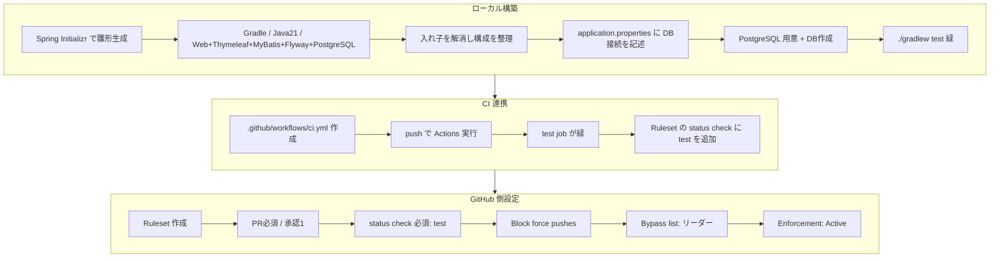

# protospace-d

プロトタイプ共有Webアプリケーション。
Spring Boot (Java 21) + Thymeleaf + MyBatis + Flyway + PostgreSQL で構築。

---

## 技術スタック

| 分類 | 技術 |
|------|------|
| 言語 | Java 21 |
| フレームワーク | Spring Boot 3.5.x |
| ビルドツール | Gradle (wrapper同梱) |
| テンプレート | Thymeleaf |
| DBアクセス | MyBatis |
| マイグレーション | Flyway |
| DB | PostgreSQL |
| CI | GitHub Actions |

---

## 環境構築（メンバー全員が各自実施）

### 前提
- WSL (Ubuntu) 環境
- Java 21 がインストール済み（無くても gradlew が面倒を見ます）

### 1. リポジトリを取得

```bash
git clone https://github.com/mfukui-smartscape/protospace-d.git
cd protospace-d
```

### 2. PostgreSQL をインストール＆起動

```bash
sudo apt update
sudo apt install -y postgresql postgresql-contrib
sudo service postgresql start
```

起動確認（`online` と表示されればOK）:

```bash
sudo service postgresql status
```

### 3. データベース・ユーザーを作成

```bash
sudo -u postgres psql -f setup_db.sql
```

> `setup_db.sql` がDB・ユーザー・権限をまとめて作成します。
> 手動で実行する場合は下記の「DBセットアップSQL」を参照。

### 4. 動作確認

```bash
./gradlew test
```

`BUILD SUCCESSFUL` が出れば環境構築完了です。
（Flyway が起動時にテーブルを自動作成します）

---

## DBセットアップSQL（参考: setup_db.sql の中身）

```sql
CREATE DATABASE protospace_development;
CREATE USER protospace WITH PASSWORD 'password';
GRANT ALL PRIVILEGES ON DATABASE protospace_development TO protospace;

-- PostgreSQL 15+ で必要（publicスキーマへの権限）
\c protospace_development
GRANT ALL ON SCHEMA public TO protospace;
```

接続設定は `src/main/resources/application.properties` に記載:

```properties
spring.datasource.url=jdbc:postgresql://localhost:5432/protospace_development
spring.datasource.username=protospace
spring.datasource.password=password
```

> ⚠ DB名・ユーザー・パスワードは設定ファイルと完全に一致させること。
> ズレると `DataSourceBeanCreationException` で起動に失敗します。

---

## チーム開発ルール

### ブランチ運用
- `main` への直接 push は禁止。**必ず Pull Request 経由**で変更を取り込む。
- 作業は機能ごとに feature ブランチを切る（例: `feature/user-signup`）。

### Pull Request / マージ
- PR には **承認（approve）1件以上が必須**。お互いにレビューし合うこと。
- **`main` へのマージはリーダーが行う**（最終的なマージ操作の集約）。
- マージ前に **CI（テスト）が緑であること**が必須。赤い PR はマージ不可。

### CI / テスト
- PR を出すと GitHub Actions が自動でテストを実行する。
- まだ実装していない機能のテストは `@Disabled`（skip）にしておき、CIを緑に保つ。
  実装が済んだら skip を外す → これが Red→Green のサイクルになる。
- 作業途中で共有・相談したい PR は **Draft Pull Request** で出す（赤でもOK）。

### コミット前の注意
- `master.key` 等の秘密情報、`build/`・`.gradle/` 等の自動生成物はコミットしない
  （`.gitignore` で除外済み）。

---

## 開発の流れ（メンバー向け）


---

## セットアップ全体像（リポジトリ初期構築の記録）



---

## プロジェクト構成

```
protospace-d/
├── .github/workflows/ci.yml   # GitHub Actions（CI）
├── src/
│   ├── main/
│   │   ├── java/              # アプリケーションコード
│   │   └── resources/
│   │       ├── application.properties
│   │       └── db/migration/  # Flyway マイグレーション
│   └── test/                  # テストコード
├── build.gradle
├── gradlew / gradlew.bat
├── setup_db.sql               # DBセットアップ
└── README.md
```

URL設計表（担当なし・技術仕様のみ）

┌──────────┬──────────────────────────┬────────────────┬──────────────┐
│ メソッド  │ パス                      │ 機能            │ アクセス制御  │
├──────────┼──────────────────────────┼────────────────┼──────────────┤
│ GET      │ /                         │ トップ（一覧）  │ 公開          │
│ GET      │ /users/new               │ 新規登録ページ  │ 公開          │
│ POST     │ /users                   │ 登録処理        │ 公開          │
│ GET      │ /login                   │ ログインページ  │ 公開          │
│ POST     │ /login                   │ ログイン処理    │ 公開          │
│ POST     │ /logout                  │ ログアウト      │ 公開          │
│ GET      │ /users/{id}              │ ユーザー詳細    │ 公開          │
│ GET      │ /prototypes/new          │ 投稿ページ      │ 認証          │
│ POST     │ /prototypes              │ 投稿処理        │ 認証          │
│ GET      │ /prototypes/{id}         │ 詳細            │ 公開          │
│ GET      │ /prototypes/{id}/edit    │ 編集ページ      │ 認証＋本人    │
│ POST      │ /prototypes/{id}         │ 更新処理        │ 認証＋本人    │
│ POST   │ /prototypes/{id}/delete       │ 削除処理        │ 認証＋本人    │
│ POST     │ /prototypes/{id}/comments│ コメント投稿    │ 認証          │
└──────────┴──────────────────────────┴────────────────┴──────────────┘